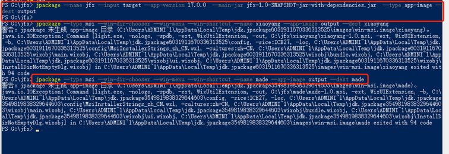
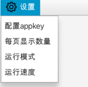
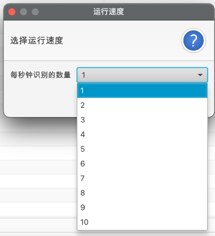
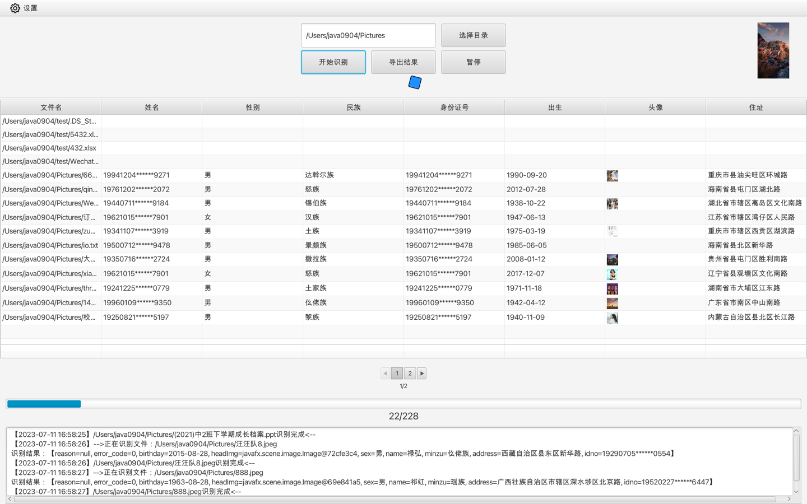

- 开发环境 

  - JDK 17(如果使用Java8开发，则没有jpackage命令)
  - JavaFX SDK 17.0.2
  - Sqlite3
  - SceneBuilder 20.0.0 
  
- 技术特点
  - controller或者组件传递信息使用事件总线的方式
  
  - 定时任务使用Quartz框架，可以开启、关闭、与动态调整线程池数量
  
    


## 1. 打成jar包

⚠️：请注意你使用的是什么系统，/src/main/resources/mybatis-config.xml中的url配置，要选择对应的系统


```shell
cd 项目目录
mvn clean package
```
如果你**本地有Java运行环境**，可以直接执行 `java -jar target/zhengjianshibie-1.0-SNAPSHOT-jar-with-dependencies.jar` 或者 `java --module-path /path/to/javafx-sdk/lib --add-modules javafx.controls,javafx.fxml -jar target/zhengjianshibie-1.0-SNAPSHOT.jar` 

/path/to/javafx-sdk/lib 需要替换成你自己本地的JavaFx SDK的路径

## 2.打成镜像

 - windows
```shell
jpackage --name zhengjianshibie --input target --app-version 1.0.0  --main-jar zhengjianshibie-1.0-SNAPSHOT-jar-with-dependencies.jar  --type app-image --dest output --icon tulip.ico  --vendor java0904 --copyright java0904 --description JavaFXMeter
```
- mac
```shell
jpackage --name zhengjianshibie --input target --app-version 1.0.0  --main-jar zhengjianshibie-1.0-SNAPSHOT-jar-with-dependencies.jar  --type app-image --dest output --icon tulip.icns  --vendor java0904 --copyright java0904 --description JavaFXMeter
```
打包成镜像之后，也是可以直接启动的

3. 打成安装包

 - windows
```shell
jpackage --type msi --win-dir-chooser --win-menu --win-shortcut --name zhengjianshibie --app-image output/zhengjianshibie --dest 
```

这里的output是上一步生成的镜像目录，注意这里一定还要加上/zhengjianshibie，不然会提示如下错误，我在执行上个命令失败后，查看C:\XXXX里面的这个文件，根本找不到，加上了--temp 参数之后，进到里面才发现目录多了一层，于是猜测是这个原因，但是这个问题我用了好几天才解决



- mac

```shell
jpackage  --name zhengjianshibie --app-image output
```
注意这里--app-image output参数不需要再加上/zhengjianshibie，和windows系统不一样
此时会生成dmg文件，安装好之后，如果打开提示文件已经损坏，则需要执行一下`安装好之后执行一下sudo xattr -r -d com.apple.quarantine /Applications/zhengjianshibie.app`


## 快速生成 Mac App icns 图标


要在Mac上使用`brew`命令安装`iconutil`，请按照以下步骤进行操作：

1. 打开终端应用程序（在“应用程序”文件夹的“实用工具”文件夹中）。

2. 输入以下命令来安装Homebrew（如果你已经安装了Homebrew，可以跳过这一步）：

   ```shell
   /bin/bash -c "$(curl -fsSL https://raw.githubusercontent.com/Homebrew/install/HEAD/install.sh)"
   ```

3. 安装`iconutil`，运行以下命令：

   ```shell
   brew install iconutil
   ```

4. 安装完成后，你现在可以在终端中使用`iconutil`命令了。

接下来，我将介绍一下`sips`命令的使用，并给出一些常用参数的示例：

`sips`是一个用于图像处理的命令行工具，可以在终端中执行各种图像操作。

常用参数和示例：

1. 调整图像大小：

   ```shell
   sips -z height width image.jpg
   ```

   示例：

   ```shell
   sips -z 600 800 image.jpg
   ```

2. 裁剪图像：

   ```shell
   sips -c top left bottom right image.jpg --out cropped_image.jpg
   ```

   示例：

   ```shell
   sips -c 100 100 400 400 image.jpg --out cropped_image.jpg
   ```

3. 旋转图像：

   ```shell
   sips -r degrees image.jpg
   ```

   示例：

   ```shell
   sips -r 90 image.jpg
   ```

4. 转换图像格式：

   ```shell
   sips -s format output_format image.jpg --out converted_image.output_format
   ```

   示例：

   ```shell
   sips -s format png image.jpg --out converted_image.png
   ```

现在，我将向你展示如何使用`sips`和`iconutil`命令来生成一个`.icns`文件：

1. 创建一个包含不同尺寸的PNG图像文件的文件夹，例如`icon.iconset`。

   ```shell
   # 下载一个图片，命名为pic.png
   mkdir icon.iconset
   ```

   

2. 将你的PNG图像文件放置在`icon.iconset`文件夹中，确保命名符合图标规范，使用`sips`命令将pic.png文件进行图像处理。

   ```shell
   # 全部拷贝到命令行回车执行，执行结束之后去tmp.iconset查看十张图片是否生成好
   sips -z 16 16     pic.png --out icon.iconset/icon_16x16.png
   sips -z 32 32     pic.png --out icon.iconset/icon_16x16@2x.png
   sips -z 32 32     pic.png --out icon.iconset/icon_32x32.png
   sips -z 64 64     pic.png --out icon.iconset/icon_32x32@2x.png
   sips -z 128 128   pic.png --out icon.iconset/icon_128x128.png
   sips -z 256 256   pic.png --out icon.iconset/icon_128x128@2x.png
   sips -z 256 256   pic.png --out icon.iconset/icon_256x256.png
   sips -z 512 512   pic.png --out icon.iconset/icon_256x256@2x.png
   sips -z 512 512   pic.png --out icon.iconset/icon_512x512.png
   sips -z 1024 1024   pic.png --out icon.iconset/icon_512x512@2x.png
   ```

   

3. 使用iconutil工具将`icon.iconset`文件夹中的PNG图像文件转换为`.icns`文件：

   ```shell
   conutil -c icns icon.iconset -o Icon.icns
   ```

4. 如果一切顺利，将在同一目录下生成一个名为`icon.icns`的`.icns`文件。

通过以上步骤，你应该能够成功生成一个`.icns`文件，其中包含来自`icon.iconset`文件夹的不同尺寸的PNG图像文件。


# 接口请求工具使用说明

- 配置相关信息

  

- 运行模式选择与说明


- 自定义运行速度



- 运行示意图

  

参考：[japckage相关命令](https://blog.csdn.net/Mr_Door/article/details/128319594?ops_request_misc=%257B%2522request%255Fid%2522%253A%2522168808751016800197025366%2522%252C%2522scm%2522%253A%252220140713.130102334..%2522%257D&request_id=168808751016800197025366&biz_id=0&utm_medium=distribute.pc_search_result.none-task-blog-2~all~top_positive~default-1-128319594-null-null.142^v88^control_2,239^v2^insert_chatgpt&utm_term=jpackage&spm=1018.2226.3001.4187)
